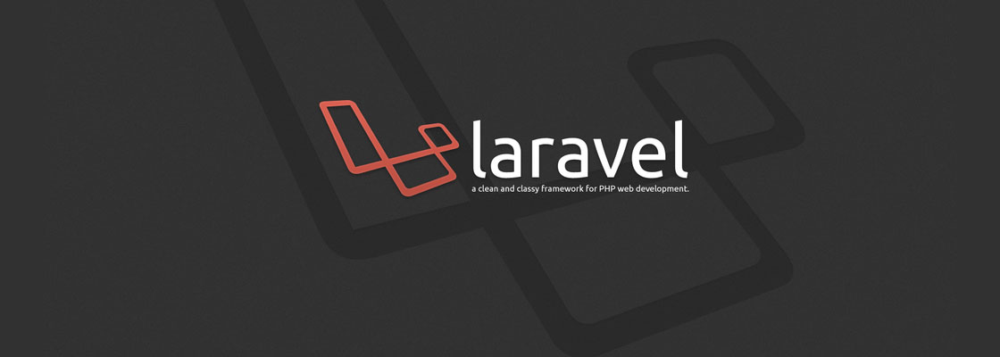

# Curso de Laravel código 49150

> Curso de Laravel |  
> Lunes y Jueves 20hs a 22hs (Arg) |  
> Código: 57751 |  
> sensei: Marcos Pinardi |

1. Definición
2. Requisitos
3. Recursos
4. Instalación
5. Iniciar el server
6. Actualizar desde un proyecto existente

## Definición
> Laravel es uno de los frameworks de código abierto más fáciles de asimilar para PHP.
> El objetivo de Laravel es el de ser un framework que permite el uso de una sintáxis refinada y expresiva para crear código de forma sencilla, evitando el “código espagueti” y permitiendo multitud de funcionalidades.
> Aprovecha todo lo bueno de otros frameworks y utiliza las características de las últimas versiones de PHP.
> Fue creado en 2011 por Taylor Otwell y tiene una gran influencia de frameworks como Ruby on Rails, Sinatra y ASP.NET MVC.  
> Gran parte de Laravel está formado por dependencias, especialmente de Symfony, esto implica que el desarrollo de Laravel dependa también del desarrollo de sus dependencias.

>> ¿Porqué Elegir Laravel?
- [ ] Desarrollo más rápido
- [ ] Menos escritura de código
- [ ] Bibliotecas para tareas comunes
- [ ] Seguir buenas prácticas
- [ ] Más seguro que escribir tus propias Apps
- [ ] Mejor para el trabajo en equipo
- [ ] Fácil de mantener

## Requisitos
> De Software

1. un terminal
- [ ] la del sistema operativo
- [ ] cmDer <https://cmder.net/>
- [ ] Cygwin <https://www.cygwin.com/>
- [ ] Git Bash <https://git-scm.com/>

2. Composer
   Composer es un administrador de dependencias en PHP.  
   <https://getcomposer.org/>  
   <https://getcomposer.org/Composer-Setup.exe>

## Recursos

Manual Oficial de Laravel <https://laravel.com/>  
Laravel News <https://laravel-news.com/>  
Laracasts <https://laracasts.com/>  
LaraJobs <https://larajobs.com/>

## Instalación
> Usando composer vamos a movernos al directorio de trabajo    
> En ese directorio vamos a crear un proyecto (carpeta con toda la magia de laravel) .  
> Con el comando "cd" nos movemos a nuestro directorio de trabajo    
> y luego, con el comando "composer create-project" crearemos un proyecto

`composer create-project laravel/laravel nombre "version"`

> Ejemplo para instalar laravel 6x  
`composer create-project laravel/laravel proyecto "6.*"`

> Ejemplo para instalar laravel (versión más actual según tu versión de PHP - no necesita especificar versión)    
`composer create-project laravel/laravel proyecto`

> Una vez finalizada la instalación instalado, nos movemos al directorio del proyecto

`cd proyecto`

> Y ya podemos arrancar el server:

> **EL MARAVILLOSO MUNDO DE ARTISAN**    
> para iniciar al server es el comando

`php artisan serve`

----

